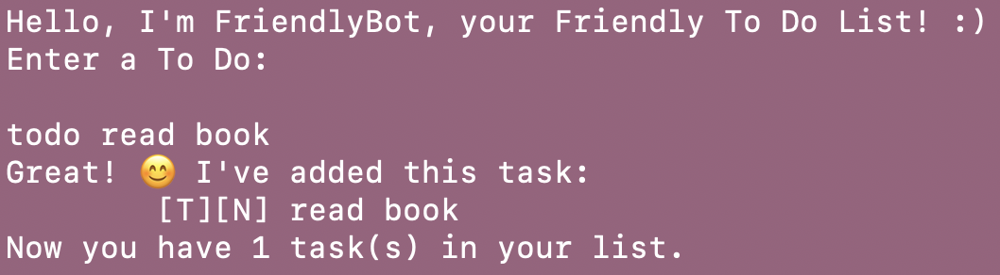
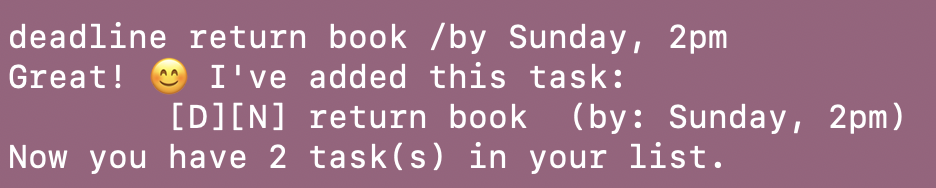
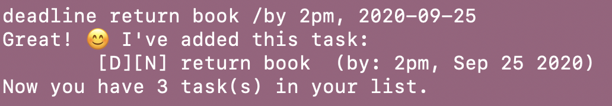
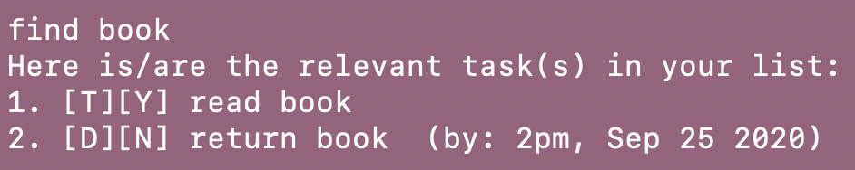

# User Guide

*  [Introduction and Flowchart](#introduction-and-flowchart)
*  [Quick Start](#quick-start)
*  [Features](#features)
   *  [Adding a new task](#adding-a-new-task): `todo` `deadline` `event`
   *  [Check/Update an existing task](#check/update-an-existing-task): `list` `done` `delete` `find`
   *  [Exiting the program](#exiting-the-program): `bye`
   *  [Saving Data](#saving-data)
*  [Command Summary](#command-summary)

## Introduction and Flowchart
FriendlyBot is your friendly todo list, that helps you to **manage three types of tasks**:
* Todos,
* Deadlines, and
* Events

FriendlyBot provides several user commands, for more functionality when managing your tasks.
These commands are shown more clearly in the flowchart below.
  

## Quick Start
1. Ensure you have Java `11` or above installed in your Computer.
1. Download the latest `ip.jar` from [here](https://github.com/elizabethcwt/ip/releases/tag/A-Release).
1. Copy and place the file into a folder on your computer.
1. Open your computer's terminal, navigate to the `ip.jar` file and run the app.
1. Refer to the features below for details of the commands available in FriendlyBot.

## Features

### Adding a new task
#### Adding a todo task: `todo`
Adds a todo task in your task list.
 Format: `todo [todo task description]`
 Examples:
 
Input: `todo read book`
 Expected output:
 

Note:
* `[T]` - Task is of **todo** type.
* `[N]` - Task is **not done**.
   
#### Adding a deadline task: `deadline`
Adds a deadline task in your task list.
 Format: `deadline [deadline task description] /by [deadline date]`
 Entering a date in `YYYY-MM-DD` format converts the date to `MONTH DD YEAR` format.
 Examples:
 
Input: `deadline return book /by Sunday, 2pm`
 Expected output:
 
    
Input: `deadline return book /by 2pm, 2020-09-25`
 Expected output:
 
  
Note:
* `[D]` - Task is of **deadline** type.
* `[N]` - Task is **not done**.

#### Adding an event task: `event`
Adds an event task in your task list.
 Format: `event [event task description] /at [event location]`
 Examples:
 
Input: `event project meeting /at school`
 Expected output:
 

Note:
* `[E]` - Task is of **event** type.
* `[N]` - Task is **not done**.
   

### Check/Update an existing task
#### Listing all tasks: `list`
Lists all the tasks (todo, deadline and event) in your current task list.
 Format: `list`
 Examples:
 
Input: `list`
 Expected output:
 

#### Marking tasks as done: `done`
Marks specific task in your task list as done.
 Format: `done [task number in task list]`
 Examples:
 
Input: `done 1`
 Expected output:
 

Note:
* `[Y]` - Task is **done**.

#### Deleting a task: `delete`
Deletes a specific task in your current task list.
 Format: `done [task number in task list]`
 Examples:
 
Input: `delete 2`
 Expected output:
 
    
#### Finding a task: `find`
Finds relevant tasks in your current task list based on keywords you provide.
 Format: `find [keyword(s)]`
 Examples:
 
Input: `find book`
 Expected output
 

### Exiting the program: `bye`
Exits FriendlyBot.
 Examples:
 
Input: `bye`
 Expected output:
 

### Saving Data
The tasks that you have added, deleted, or edited in any way will be saved externally in a file.
 If this file doesn't already exist in your computer, a new file will be created.
 When you re-run FriendlyBot, the data (i.e. tasks in your friendly task list) will be loaded, and entering the `list` command will trigger the display of your updated task list, where you left off previously.

## Command Summary

|Action|Format|Examples|
|--------------|----------------|----------------|
|Add todo|`todo [todo task description]`|`todo read book`|
|Add deadline|`deadline [deadline task description] /by [deadline date]`|`deadline return book /by 2pm, 2020-09-25`|
|Add event|`deadline [event task description] /at [event location]`|`event project meeting /at school`|
|List|`list`|
|Done|`done [task number in task list]`|`done 2`|
|Delete|`delete [task number in task list]`|`delete 2`|
|Find|`find [keyword(s)]`|`find book`|
|Bye|`bye`|
